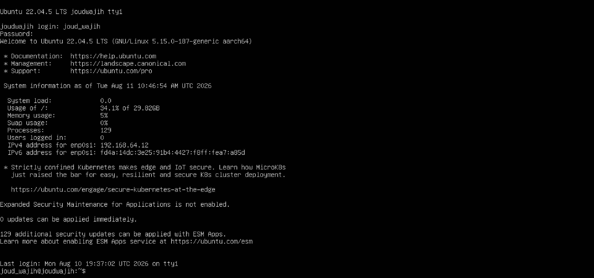
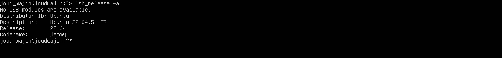
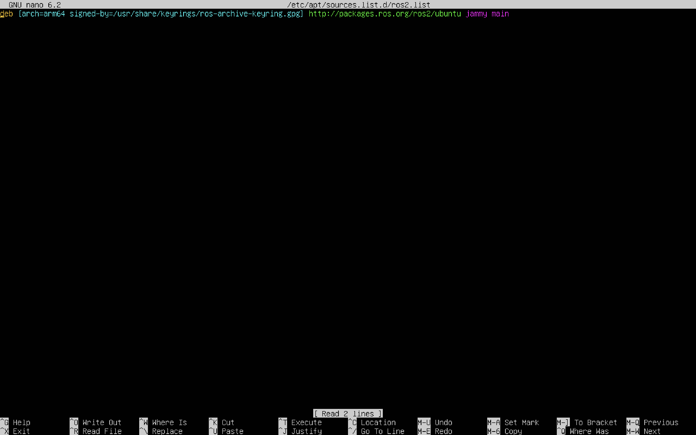

# ROS 2 Installation Report Using UTM

## Project Overview

This report documents the installation process of ROS 2 on Ubuntu Server using UTM on macOS.

The goal of this task is to prepare a Linux environment for robotics development and install ROS 2 successfully using terminal commands.

---

## Tools Used

- macOS
- UTM Virtual Machine
- Ubuntu Server 22.04.5 LTS
- Terminal
- ROS 2 Humble

---

## Installation Environment

| Item | Description |
|---|---|
| Virtual Machine Tool | UTM |
| Operating System | Ubuntu Server 22.04.5 LTS |
| Ubuntu Codename | Jammy |
| ROS 2 Distribution | Humble |
| Installation Type | ROS Base |
| Interface | Terminal only |

---

## Step 1: Ubuntu Server Login

Ubuntu Server was installed and launched successfully using UTM.

After installation, the system displayed the login screen. The username and password were entered to access the Ubuntu terminal.



---

## Step 2: Check Ubuntu Version

Before installing ROS 2, the Ubuntu version was checked to make sure it is compatible with ROS 2 Humble.

```bash
lsb_release -a
```

The result showed that the installed system is:

```text
Ubuntu 22.04.5 LTS
Codename: jammy
```



---

## Step 3: Update System Package List

The package list was updated using the following command:

```bash
sudo apt update
```

This step allows Ubuntu to get the latest package information from the available repositories.


---

## Step 4: Install Required Tools

The required tools were installed before adding the ROS 2 repository.

```bash
sudo apt install software-properties-common curl -y
```

These tools are needed to manage repositories and download the ROS 2 key.


---

## Step 5: Enable Universe Repository

The Ubuntu Universe repository was enabled because ROS 2 requires some packages from it.

```bash
sudo add-apt-repository universe
```


---

## Step 6: Add ROS 2 GPG Key

The ROS 2 GPG key was added to allow Ubuntu to verify ROS 2 packages.

```bash
sudo curl -sSL https://raw.githubusercontent.com/ros/rosdistro/master/ros.key -o /usr/share/keyrings/ros-archive-keyring.gpg
```

---

## Step 7: Add ROS 2 Repository

A new ROS 2 repository file was created using nano:

```bash
sudo nano /etc/apt/sources.list.d/ros2.list
```

The following line was added inside the file:

```text
deb [arch=arm64 signed-by=/usr/share/keyrings/ros-archive-keyring.gpg] http://packages.ros.org/ros2/ubuntu jammy main
```

Then the file was saved using:

```text
Ctrl + O
Enter
Ctrl + X
```

After adding the repository, the package list was updated again:

```bash
sudo apt update
```


---

## Step 8: Install ROS 2 Humble ROS Base

Since Ubuntu Server does not include a graphical desktop interface, ROS 2 Humble ROS Base was installed instead of the desktop version.

```bash
sudo apt install ros-humble-ros-base -y
```

ROS Base is suitable for terminal-based ROS 2 development and includes the core ROS 2 tools and communication packages.



---

## Step 9: Source ROS 2 Environment

After installation, the ROS 2 setup file was sourced:

```bash
source /opt/ros/humble/setup.bash
```

To make ROS 2 available automatically every time a new terminal opens, the setup command was added to `.bashrc`:

```bash
echo "source /opt/ros/humble/setup.bash" >> ~/.bashrc
source ~/.bashrc
```

---

## Step 10: Test ROS 2 Installation

The ROS 2 installation was tested using:

```bash
ros2 --help
```

The command displayed the available ROS 2 commands, such as:

```text
action
bag
component
daemon
doctor
interface
launch
node
param
pkg
run
service
topic
```

This confirms that ROS 2 was installed successfully.


---

## Problems Faced

During the installation process, some issues appeared:

### 1. Ubuntu Reboot Returned to the Installer

After installation, Ubuntu returned to the setup screen after rebooting.  
This happened because the ISO file was still attached in UTM.

The issue was solved by removing or ejecting the ISO file from the virtual machine settings.

---

### 2. Repository File Path Error

At first, the ROS 2 repository file path was typed incorrectly.

The incorrect path was:

```text
/etc/apt.sources.list.d/ros2.list
```

The correct path is:

```text
/etc/apt/sources.list.d/ros2.list
```

---

### 3. Repository Component Typing Error

The word `main` was accidentally written as `mainx`, which caused warnings during `sudo apt update`.

The issue was fixed by editing the repository file and changing:

```text
mainx
```

to:

```text
main
```

---

### 4. ros2 Command Not Found

At one point, the command:

```bash
ros2 --version
```

did not work.

This is because `ros2 --version` is not the correct test command for ROS 2.

The correct test command used was:

```bash
ros2 --help
```

---

## Result

ROS 2 Humble ROS Base was installed successfully on Ubuntu Server 22.04.5 using UTM.

The installation was verified using the `ros2 --help` command, which displayed the available ROS 2 command-line tools.

---

## Conclusion

In this task, Ubuntu Server was installed using UTM, and ROS 2 Humble was installed through the terminal.

The process included:

- Installing Ubuntu Server
- Updating system packages
- Adding the ROS 2 repository
- Installing ROS 2 Humble ROS Base
- Sourcing the ROS 2 environment
- Testing the ROS 2 command-line tool

This task helped prepare a robotics development environment for future ROS 2 projects.
